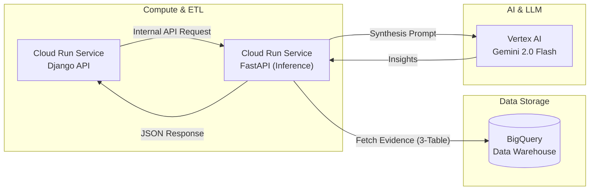
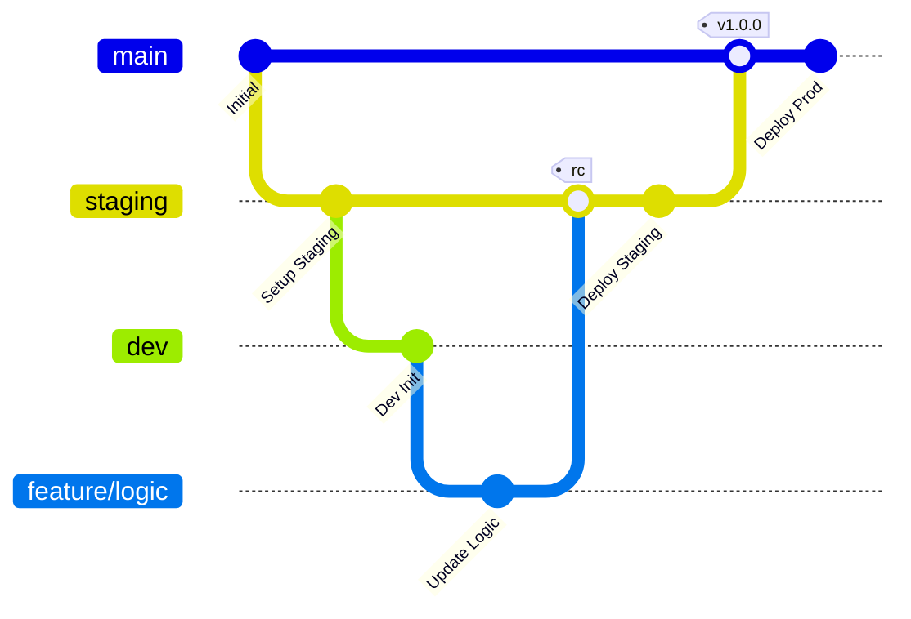

# Celestial Inference Engine

**The "Brain" of the Celestial Biome project.**
Gemini 2.0 Flash を活用し、宇宙・地球・社会のデータを統合して「特異点」を抽出する推論マイクロサービス。

## 🌌 Overview
一見無関係に見えるデータ群を BigQuery から抽出・合成し、LLM による相関分析を提供します。

### 🚀 Core Logic: 3-Table Synthesis
以下の 3 つのドメインデータを BigQuery から取得し、Correlated Inference（相関推論）を実行します。
* **Space:** `space_weather_metrics` (太陽風、Kp指数等)
* **Earth:** `earthquakes_raw` (地震の規模、発生場所)
* **Economy:** `economy_raw` (主要国の経済指標、株価)

## 🛠 Tech Stack
* **Runtime:** Python 3.12 / FastAPI
* **AI Model:** Gemini 2.0 Flash (Vertex AI)
* **Data Warehouse:** Google BigQuery
* **Infrastructure:** Google Cloud Run, Terraform
* **CI/CD:** GitHub Actions

## 📡 API Endpoints
- `POST /v1/predict`: プロンプトに基づき、最新の計測データをコンテキストに含めた推論結果を返却します。

## 🏗 Infrastructure (Terraform)
環境によるデータセットの完全分離を実現しています。
- **Staging:** `celestial_biome_data_staging`
- **Production:** `celestial_biome_data`
- **Custom Domain:** `inference.celestial-biome.com`

## Development Workflow
本プロジェクトは、GitHub Actions による継続的デプロイメントを採用しています。

- Staging: staging ブランチへのマージで inference-service-staging へデプロイ。

- Production: main ブランチへのマージで inference-service-prod へデプロイ。